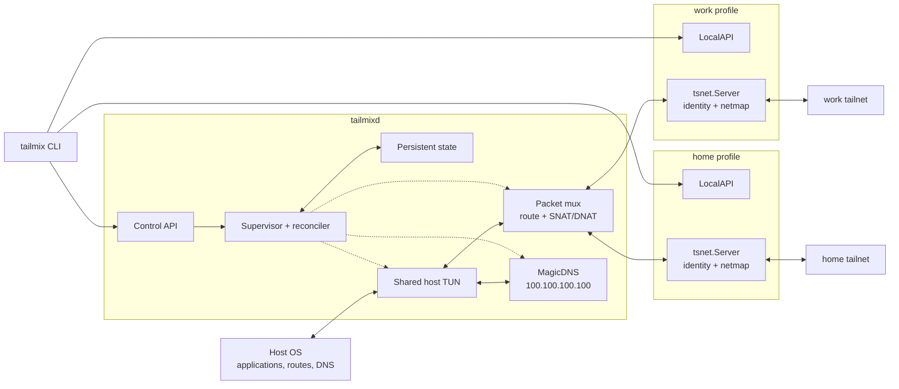
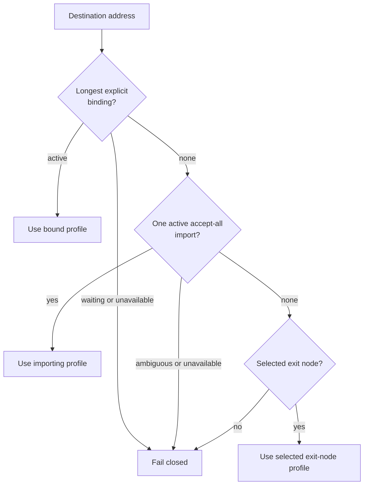
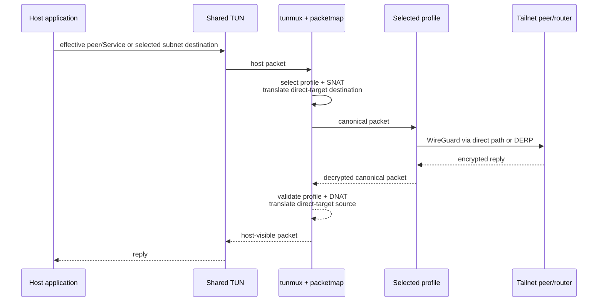
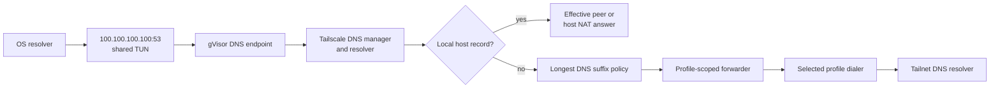
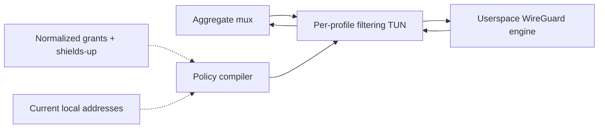

# tailmix architecture

> Implementation snapshot: September 2026

tailmix runs an independent network engine for every profile, then joins their
packet paths behind one host TUN. An engine is either an embedded Tailscale node
or a userspace raw WireGuard device. Stable local addresses remove cross-profile
IP collisions. Translation restores each profile's canonical addresses before
traffic reaches its engine.

The result is one daemon, one shared TUN, and one isolated engine per profile
on macOS or Linux.

## System overview

There is no active-tailnet switch. The OS sees one interface and a
collision-free set of effective peer and Tailscale Service addresses. tailmix
selects a profile for each packet; upstream Tailscale continues to own
authentication, netmaps, WireGuard, DERP, ACL-visible identity, and transport
behavior.



Three invariants keep the profiles isolated:

1. **One engine, one identity.** Every profile has its own keys, configuration,
   runtime, and state directory.
2. **No canonical target addresses on the host.** Direct peers and Tailscale
   Services use effective addresses. Canonical CGNAT and ULA addresses appear
   only after profile selection.
3. **DNS returns effective addresses.** Local MagicDNS answers do not expose a
   peer's or Service's canonical address to applications.

## Ownership boundaries

tailmix carries focused [`tsnet`](../tsnet/README.md) and
[`netns`](../netns/README.md) forks. The former substitutes a channel-backed
`Server.Tun` and exposes `Server.LocalBackend`; the latter publishes Darwin's
physical underlay through the shared netmon state consumed by upstream
Tailscale sockets. The daemon uses published Tailscale modules for the
remaining engine, LocalAPI, credential, and transport behavior.

| Concern | tailmix owns | Profile engine / upstream Tailscale owns |
| --- | --- | --- |
| Host networking | Shared TUN, host addresses, selected routes | No direct host interface |
| Addressing | Effective leases, host NAT addresses, profile selection, SNAT/DNAT | Canonical self, peer, and Service addresses from the netmap |
| Route policy | Explicit bindings, accept-all imports, ambiguity handling | Advertised route and resolver data |
| Control plane | Profile lifecycle and aggregate reconciliation | Login, coordination, netmap, peer updates, preferences |
| LocalAPI | Profile selection and one socket per profile | `ipnserver`, peer credentials, operator permissions |
| Transport | Injection into the selected profile TUN | WireGuard, endpoint discovery, direct links, DERP, encryption |
| DNS | Aggregate host records, suffix policy, search domains, profile-scoped forwarding | Tailscale DNS manager, configurator, and resolver machinery |
| Authorization | Raw WireGuard packet policy and persistent shields-up override | Tailscale ACLs, grants, device approval, Tailnet Lock, shields-up |

An effective address selects a route; it does not become a Tailscale identity.
Remote policy sees the selected profile's canonical identity exactly as it
would for an ordinary Tailscale node.

## Address model

Canonical addresses can collide across tailnets. tailmix leases a unique
effective address to each `(profile, target, canonical IP)` tuple and reserves
one host NAT address per active address family. A target is either a peer node
or a Tailscale Service.

| Address | Visible where | Purpose | Lifetime |
| --- | --- | --- | --- |
| Effective target IP | Host DNS, routes, sockets, shared TUN | Collision-free node or Service dial target and profile lookup key | Persisted and retained when a target disappears |
| Host NAT IP | Host interface and packet translation | Stable local source/destination per address family | Persisted with the selected pool |
| Canonical Tailscale IP | One profile engine and its tailnet | Real Tailscale self, peer, or Service addressing and ACL-visible traffic | Assigned by that tailnet |
| `100.100.100.100` | Host DNS configuration and shared TUN | Tailscale-defined MagicDNS service address | Fixed and never allocated from an effective pool |
| Subnet destination IP | Host routes and selected profile | Original address behind an advertised subnet router | Not translated as a peer address |

The lease key is:

```text
(profile ID, stable node or Service ID, canonical Tailscale IP)
    -> persisted effective IP
```

Including the profile ID distinguishes identical canonical addresses in two
tailnets. Node stable IDs and `svc:` names identify their respective targets.
Including the canonical IP gives IPv4 and IPv6 independent leases.

The default pools are:

```text
IPv4  100.127.0.0/24
IPv6  fd6d:6e65:7400::/56
```

Pool selection is persisted. Changing one family retires that family's leases
and host NAT address, then allocates new values. A pool must not overlap other
local routes.

### Direct-target translation example

| Stage | Source | Destination |
| --- | --- | --- |
| Host emits | `100.127.0.1` host NAT | `100.127.0.8` effective target |
| work engine receives | `100.64.0.1` canonical self | `100.64.0.42` canonical target |
| work engine replies | `100.64.0.42` | `100.64.0.1` |
| Host receives | `100.127.0.8` | `100.127.0.1` |

The values are illustrative. tailmix leaves the pool's prefix base unassigned,
reserves the first available non-base address for host NAT, excludes it from
target allocation, and selects it as the preferred source for host TUN routes.
Host routes are installed only for active peers, visible Services, and selected
subnet routes.

## Route policy

Route policy is separate from profile lifecycle. A profile may be connected
without contributing every route it advertises.

### IP routes



- `routes bind` creates an explicit prefix-to-profile override.
- `routes set --accept-all=true` imports every non-default route advertised by
  that profile.
- Longest-prefix matching chooses the most specific explicit binding.
- An explicit binding must be covered by an advertised route from that profile.
- The same accept-all route imported from multiple profiles is ambiguous and
  remains disabled until an explicit binding resolves it.
- Routes that overlap Tailscale's canonical ranges, the effective pools, host
  NAT addresses, or the MagicDNS service address fail closed.
- One explicit profile-and-peer exit-node selection supplies the fallback
  default route after direct-peer and subnet policy.
- Disabling the selected profile withdraws the default; no other profile is
  selected automatically.

### DNS routes

DNS policy first selects the longest matching suffix. These tiers break ties
between entries for the same suffix:

1. explicit `dns routes bind` entries;
2. profile-wide `dns routes set --accept-all=true` imports;
3. automatic per-profile MagicDNS suffixes and the selected exit profile's
   effective default DNS route.

An explicit suffix binding must be covered by a route advertised by the
selected profile. Ambiguous accept-all or MagicDNS suffixes remain disabled.
The root suffix `.` represents a profile's default resolver route.
The exit-node default is derived rather than persisted, so an explicit root
binding overrides it and remains installed after the exit node is cleared.

Search domains are a separate ordered list. A configured search domain is
installed in the OS only when an active DNS route covers it. This keeps
short-name expansion separate from resolver selection.

## Packet path

Routing uses immutable BART tables. Direct peers and Tailscale Services occupy
exact `/32` or `/128` entries; selected subnet routes use longest-prefix
matching.

### Outbound: host to tailnet

1. The OS sends a packet through the shared TUN.
2. The mux offers traffic for `100.100.100.100` to the local DNS service.
3. A direct-target entry or selected subnet route chooses the profile.
4. The source table returns that profile's canonical self address.
5. The mapper rewrites the source in place and updates checksums.
6. For a direct peer or Service, it also replaces the effective destination
   with the canonical target address. A subnet destination is preserved.
7. The packet crosses the selected `ChanTUN`.
8. Tailscale encrypts and sends it directly or through DERP.

### Inbound: tailnet to host

1. A profile engine decrypts a packet and writes it to its `ChanTUN`.
2. The producing channel identifies the profile.
3. A canonical direct-peer or Service source becomes its effective source. A
   subnet source must match an active route pinned to that same profile.
4. The canonical self destination becomes the host NAT address.
5. Checksums are updated and the packet is written to the shared host TUN.
6. The OS delivers it to a local socket; normal host firewall behavior applies.



## DNS path

tailmix reuses Tailscale's DNS manager, resolver, and OS integration. A small
gVisor stack terminates UDP and TCP DNS packets inside the shared TUN at
`100.100.100.100`.



Each active profile contributes an automatic MagicDNS suffix. Local peer
records return effective addresses, and each profile's own name returns the
shared host NAT address. A uniquely owned shared-in FQDN can receive an
exact-name route without claiming its entire source suffix.

For advertised split-DNS and default resolvers, tailmix creates a loopback
forwarder tied to the chosen profile. Classic DNS and DNS-over-HTTPS connections
therefore travel through that profile rather than the host's default network.

On macOS, the Tailscale DNS manager installs native split-DNS resolver entries.
When a root DNS route is active, it installs a synthetic System Configuration
DNS service with an empty supplemental match domain so macOS sends
otherwise-unmatched queries to the aggregate service.
On Linux, it selects the available systemd-resolved, NetworkManager, resolvconf,
or direct `resolv.conf` integration. DNS is registered at the IPv4 service
address, but answers may contain effective IPv4 or IPv6 addresses.

## Raw WireGuard packet filtering

Each raw WireGuard runtime wraps its channel-backed device with a filtering TUN
before giving it to the upstream userspace WireGuard engine:



The wrapper uses upstream Tailscale packet parsing, fragment handling, flow
tracking, and filter semantics. Packets delivered by WireGuard are checked as
inbound before reaching the aggregate mux; host-originated packets are checked
as outbound before encryption. Each profile owns independent filter state, so
flows and fragments never cross profile boundaries.

Manifest selectors compile against WireGuard AllowedIPs ownership. Source
selectors are restricted to address ranges the engine can authenticate, using
longest-prefix ownership and subtraction for overlaps. Destination selectors
compile only against destinations the runtime can currently deliver; transit
selectors stay in desired state but are inactive until forwarding exists. The
compiler publishes immutable match tables, keeping packet-path evaluation free
of YAML parsing and peer-name lookup.

Runtime creation starts with an outbound-only filter. Startup and live apply
publish the new restrictive filter before exposing permissive runtime or
persisted state; any later failure restores the previous device config and
filter. Identity changes recompile the existing normalized policy. Persistent
shields-up replaces the compiled grants with the same outbound-only baseline
without mutating the manifest.

## Reconciliation and live management

The supervisor is the single owner of desired profile state and aggregate
networking. CLI mutations arrive over the daemon control socket. Each profile
also watches its local IPN bus for netmap, peer, preference, and backend-state
changes.

```mermaid
flowchart LR
    Change["CLI mutation or<br/>profile update"] --> Snapshot["Snapshot all usable profiles"]
    Snapshot --> Policy["Build IP + DNS policy"]
    Policy --> Leases["Reuse or allocate<br/>effective leases"]
    Leases --> Plan["Compile mapper,<br/>host routes, and DNS"]
    Plan --> Mapper["Publish fail-closed mapper"]
    Mapper --> Host["Reconcile host TUN"]
    Host --> DNS["Reconfigure DNS"]
    DNS --> Save["Atomically save state"]
```



Profile watcher notifications are coalesced. A reconciliation:

1. reads current status from each enabled runtime;
2. builds IP and DNS policy from observed advertisements and desired bindings;
3. allocates or reuses effective leases;
4. compiles packet tables, host addresses/routes, DNS routes, search domains,
   forwarders, and host records;
5. publishes a fail-closed immutable mapper before changing host routes;
6. applies host and DNS configuration;
7. atomically saves the resulting state.

The mux holds an `atomic.Pointer` to its immutable mapper, so packet readers do
not lock the route table. In-flight packets finish against the previous plan;
later packets see the replacement.

Profile startup, status, watcher, and LocalAPI failures are recorded per
profile. Healthy profiles and the daemon control API remain available. A
host-network or aggregate mux failure still stops the daemon. Applying the OS,
mapper, DNS, and disk state is ordered but not transactional across all four
systems.

## Packet ownership

Packet mapping is a hot-path operation. The mapper decodes and rewrites its
slice directly.

| Boundary | Copy? | Reason |
| --- | --- | --- |
| `packetmap.Outbound` / `Inbound` | In place | The forwarding worker exclusively owns the packet during translation |
| Host read buffer to profile `Outbound` queue | Copy | The TUN read loop reuses its batch buffers while the profile consumes asynchronously |
| Profile `tun.Device.Write` to `Inbound` queue | Copy | The caller may reuse its write buffer after the method returns |
| Queue to host TUN write | Framing copy | The TUN API requires transport-header headroom |
| DNS packet to gVisor | Copy | An asynchronous local network stack takes ownership |

The queue-boundary copies are required by the asynchronous channel-backed TUN
model even though address translation itself is safe in place.

## Identity and persistence

The physical host appears as a different Tailscale device in every tailnet.
Profiles share the host network but not identity or authentication material.

`state.json` stores:

- effective address pools and host NAT addresses;
- profile definitions and lifecycle flags;
- persistent raw WireGuard shields-up overrides;
- explicit IP and DNS bindings;
- per-profile accept-all settings;
- the ordered search-domain list;
- historical effective leases;
- the selected exit-node profile ID, stable peer ID, and canonical peer IP.

The file is written with mode `0600` through a temporary file and rename. Each
`profiles/<id>` directory separately stores that profile's machine identity,
node identity, login session, preferences, and control-plane cache.

Interactive login uses the profile's LocalAPI. Unattended enrollment accepts an
explicit per-profile auth key. Profile engines ignore ambient `TS_AUTHKEY` and
`TS_AUTH_KEY` values so one process-wide key cannot accidentally enroll every
identity into the same tailnet.

Remote logtail upload is disabled by default. `-log-upload` opts in, and
`-log-upload-url` replaces the upload base URL.

## Platforms and modes

| Surface | macOS | Linux |
| --- | --- | --- |
| TUN creation | Tailscale `tstun`, dynamic `utun*` | Tailscale `tstun`, default `tailmix0` |
| Privileges | Root | Root or `CAP_NET_ADMIN` |
| Profile LocalAPI | Unix sockets served by `ipnserver` | Unix sockets served by `ipnserver` |
| Address and route application | `ifconfig` and `route` | Netlink |
| Exit-node defaults | Split defaults plus a scoped physical `/0`; underlay sockets bind that interface | Split defaults in a dedicated policy table; marked underlay sockets bypass it |
| DNS | Native split-DNS configurator | Upstream Linux configurator selection |
| Cleanup | Routes and addresses removed before TUN close | Routes and addresses removed before TUN close |

The default `-mode tun` provides system-wide IPv4/IPv6 connectivity, inbound
delivery, dynamic policy reconciliation, and DNS integration.

The fallback `-mode socks` exposes one SOCKS5 listener and selects profiles from
effective addresses, subnet policy, and DNS suffix policy. It supports TCP only
and does not install host routes or DNS configuration.

## Package map

| Package | Responsibility |
| --- | --- |
| [`cmd/tailmixd`](../cmd/tailmixd/main.go) | Composition root, supervisor, flags, plan construction |
| [`cmd/tailmix`](../cmd/tailmix/main.go) | Live management CLI and profile-scoped upstream Tailscale commands |
| [`controlapi`](../controlapi/server.go) | Credential-checked daemon management API |
| [`profile`](../profile/manager.go) | Engine abstraction, status, update watchers, tsnet adapter |
| [`profilesocket`](../profilesocket/path.go) | Stable daemon and per-profile LocalAPI socket paths |
| [`routingpolicy`](../routingpolicy/policy.go) | IP/DNS bindings, accept-all imports, overrides, ambiguity handling |
| [`tsnet`](../tsnet/tsnet.go) | Upstream-derived embedded node with LocalBackend access |
| [`netns`](../netns/netns.go) | Upstream-derived logical network namespace plus Darwin underlay publication |
| [`hosttun`](../hosttun/hosttun.go) | Shared host interface and macOS/Linux route reconciliation |
| [`tunmux`](../tunmux/mux.go) | Bidirectional packet pumps and profile channel TUNs |
| [`packetmap`](../packetmap/packetmap.go) | BART lookups and in-place address/checksum translation |
| [`effectiveip`](../effectiveip/effectiveip.go) | Stable, family-aware peer and Service lease allocation |
| [`dns`](../dns/service.go) | Aggregate DNS service, OS integration, and profile forwarders |
| [`state`](../state/state.go) | Persistent schema and atomic JSON store |
| [`socksproxy`](../socksproxy/router.go) | Userspace-mode profile selection and TCP forwarding |
| [`integration`](../integration/multitailnet_test.go) | Cross-package multi-tailnet contracts |

## Current scope

Implemented:

- concurrent direct-peer reachability across multiple profiles;
- concurrent Tailscale Service reachability across multiple profiles;
- stable effective IPv4 and IPv6 leases;
- shared host SNAT/DNAT and selected subnet routes;
- live profile add, enable, disable, restart, rename, and removal;
- explicit and accept-all IP route policy with fail-closed overrides;
- one explicit cross-profile exit-node selection with TUN and SOCKS fallback;
- explicit, accept-all, and automatic DNS suffix policy;
- profile-scoped forwarding to advertised DNS resolvers;
- ordered OS search domains backed by active DNS routes;
- dynamic peer, route, packet-map, and DNS reconciliation;
- profile-scoped upstream Tailscale CLI commands through native `ipnserver`;
- per-profile runtime failure isolation;
- macOS and Linux host TUN implementations.

Deliberate current limits:

- SOCKS mode is TCP-only;
- policy does not provide cross-profile failover;
- tailmix does not automatically bridge one tailnet into another;
- host networking, mapper, DNS, and disk updates do not share one transactional
  rollback boundary.

For operator guidance, see the [README](../README.md). For detailed CLI and
control semantics, see [profile management](profile-management.md). For
product-level design constraints, see [design](design.md).
